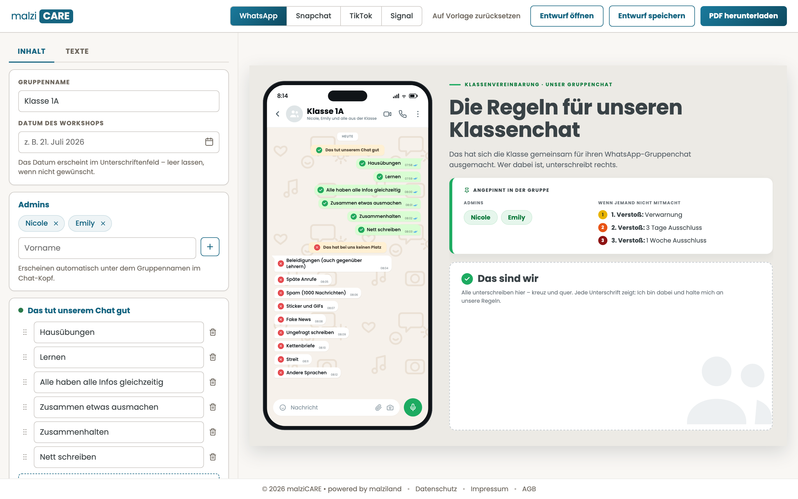
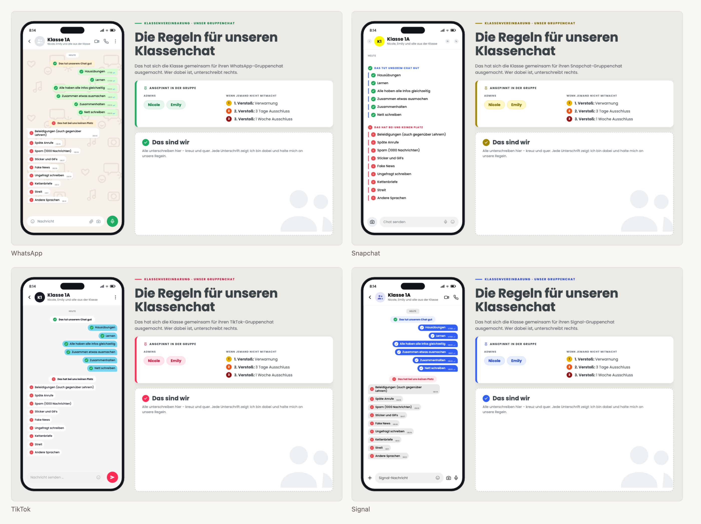

# malziCARE

Editor für Klassenchat-Regeln. Eine Klasse trägt ihre Vereinbarungen ein und
druckt sie als A3-Plakat – in der Optik der App, die sie selbst benutzt:
WhatsApp, Snapchat, TikTok oder Signal.

**Live: <https://malzi.care>**



Links werden Regeln, Admins und Folgen eingetragen, rechts entsteht das Plakat
mit – und zwar in der Optik der App, die die Klasse wirklich benutzt:



## Was ihn ausmacht

**Nichts verlässt das Gerät.** Kein Konto, kein Server, keine Datenbank, kein
Tracking. Alles läuft im Browser; das PDF entsteht dort. Die eingetragenen
Namen von Schülerinnen und Schülern bleiben, wo sie eingetippt wurden.

**Das Plakat ist A3 quer.** Es hängt gedruckt im Klassenzimmer und wird aus
zwei bis drei Metern gelesen – daran ist die Gestaltung ausgerichtet.

## Loslegen

```bash
npm run setup          # Abhängigkeiten und Testbrowser einrichten
npm run run            # Editor lokal starten
npm run verify         # alle Prüfungen: Format, Linter, Verweise, Geheimnisse, Tests
npm run vor-dem-push   # dieselben Prüfungen wie die Pipeline, vor dem Push
```

Wer CSS, JavaScript oder ein Symbol ändert, erhöht danach den Cache-Buster:

```bash
node tools/cache-buster.mjs --erhoehen
```

Sonst zeigen Browser bis zu sieben Tage die alte Fassung. Ein Wächter in der
Prüfkette meldet den Fall; ein Buster, der bei Änderungen nicht steigt, ist
keiner.

Die Symbole der Marke entstehen aus einem Werkzeug, nicht aus Handarbeit:

```bash
node tools/icons-bauen.mjs
```

`vor-dem-push` unterscheidet sich von `verify` in einem Punkt: Es bleibt beim
ersten Mangel nicht stehen, sondern zeigt alle auf einmal – und prüft zusätzlich,
was die Pipeline prüft. Es läuft nur, wenn du es aufrufst; es gibt bewusst keinen
Git-Hook, der bei jedem Commit dazwischenfunkt.

Ein Nachbau von Grund auf, in einem leeren Verzeichnis:

```bash
git clone <repo> malzicare && cd malzicare
npm run setup && npm run verify
```

## Aufbau

| Ordner    | Inhalt                                                                |
| --------- | --------------------------------------------------------------------- |
| `public/` | **genau das, was auf dem Webspace liegt** – nichts sonst wird geladen |
| `tools/`  | Bau, Prüfung, Auslieferung                                            |
| `tests/`  | Unit-Tests (`node --test`) und Oberflächentests (Playwright)          |
| `docs/`   | Entscheidungen, Runbook, Nachweise                                    |

Die Trennung ist kein Ordnungssinn, sondern ein Riegel: Was nicht in `public/`
liegt, kann nicht versehentlich mit ausgeliefert werden – und was darin liegt,
wird vollständig ausgeliefert, unsichtbare Dateien eingeschlossen.

## Ausliefern

```bash
npm run deploy            # Riegel, Upload per FTPS, Messung danach
npm run deploy -- --probe # Trockenlauf ohne Verbindung
npm run verify:live       # nur nachmessen, was oben liegt
```

Zugangsdaten stehen in `.env` (Vorlage: `.env.example`). Die Datei steht in
`.gitignore` und gehört niemals ins Repository. Fehlt ein Wert, bricht die
Auslieferung ab, statt halb zu laufen.

Der Ablauf, die Rückwege und der Stand der Nachweise stehen in
[docs/RUNBOOK.md](docs/RUNBOOK.md) und [docs/VERIFICATION.md](docs/VERIFICATION.md).

## Mitarbeiten

Fehlerberichte, Rückmeldungen aus dem Unterricht und Verbesserungen sind
willkommen – wie und was, steht in [CONTRIBUTING.md](CONTRIBUTING.md). Für den
Umgangston gilt der [Verhaltenskodex](CODE_OF_CONDUCT.md); ein Projekt über
Chat-Regeln sollte sich an eigene halten. Sicherheitsrelevantes bitte nicht
öffentlich melden, siehe [SECURITY.md](SECURITY.md).

## Lizenz

[MIT](LICENSE) – © 2026 Christoph Krieger, malziland – learning | training |
consulting e.U.

Die Schrift Poppins steht unter der SIL Open Font License
(`public/assets/fonts/OFL.txt`). WhatsApp, Snapchat, TikTok und Signal sind
Marken ihrer jeweiligen Inhaber; malziCARE steht in keiner Verbindung zu ihnen
und bildet ihre Oberflächen nur nach, damit Jugendliche ihre eigenen Regeln
darin wiedererkennen.
